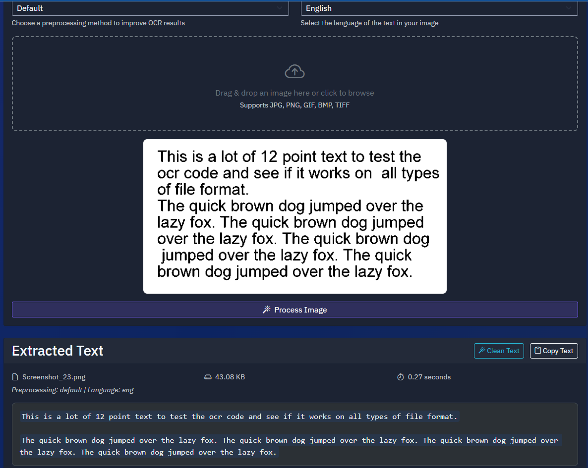

# TextExtractPro

<div align="center">
  
  <br>
  <p><em>Extract text from images with ease</em></p>
</div>

TextExtractPro is a powerful OCR (Optical Character Recognition) application built with FastAPI that provides a robust text extraction service. The application allows users to extract text from images and documents efficiently.

## Features

- OCR processing for various image formats
- RESTful API endpoints
- Web interface for easy text extraction
- Database integration for storing results
- Docker support for containerized deployment

## Tech Stack

- Python
- FastAPI (Web framework)
- Uvicorn (ASGI server)
- SQLAlchemy (Database ORM)
- Tesseract OCR (OCR engine)
- PostgreSQL (Database)

## Prerequisites

### 1. Install Tesseract OCR

#### Windows:
1. Download the installer from [UB Mannheim](https://github.com/UB-Mannheim/tesseract/wiki)
2. Run the installer and note the installation path
3. Add Tesseract to your system PATH:
   - Search for "Environment Variables" in Windows
   - Edit the PATH variable
   - Add the Tesseract installation directory (e.g., `C:\Program Files\Tesseract-OCR`)

#### Linux (Ubuntu/Debian):
```bash
sudo apt update
sudo apt install tesseract-ocr
sudo apt install libtesseract-dev
```

#### macOS:
```bash
brew install tesseract
```

### 2. Install PostgreSQL
- Download and install PostgreSQL from [postgresql.org](https://www.postgresql.org/download/)
- Create a database for the application

### 3. Verify Installation
```bash
tesseract --version
```

## Project Structure

```
TextExtractPro/
├── ocr_app/           # Main OCR application package
│   ├── api.py        # FastAPI application and routes
│   ├── ocr.py        # OCR processing functions
│   └── image_processor.py # Image preprocessing
├── static/            # Static files
├── templates/         # HTML templates
├── main.py           # Application entry point
├── database.py       # Database configuration
├── models.py         # Database models
├── requirements.txt  # Python dependencies
└── docker-compose.yml # Docker configuration
```

## Installation

### Option 1: Docker (Recommended)

The easiest way to run TextExtractPro is using Docker. This method automatically sets up all dependencies, including Tesseract OCR and language packs.

1. Install Docker and Docker Compose on your system
2. Clone the repository:
```bash
git clone [your-repository-url]
cd TextExtractPro
```

3. Build and run with Docker Compose:
```bash
docker-compose up --build
```

The application will be available at:
- Web interface: http://localhost:5000
- API documentation: http://localhost:5000/docs

### Option 2: Manual Installation

1. Clone the repository:
```bash
git clone [your-repository-url]
cd TextExtractPro
```

2. Create and activate a virtual environment:
```bash
# Windows
python -m venv venv
.\venv\Scripts\activate

# Linux/macOS
python -m venv venv
source venv/bin/activate
```

3. Install Python dependencies:
```bash
pip install -r requirements.txt
```

4. Set environment variables (optional):
```bash
# Windows
set PORT=5000
set TESSERACT_CMD=C:\Program Files\Tesseract-OCR\tesseract.exe

# Linux/macOS
export PORT=5000
export TESSERACT_CMD=/usr/bin/tesseract
```

## Running the Application

### Using Docker

1. Start the application:
```bash
docker-compose up
```

2. For development with auto-reload:
```bash
docker-compose up --build
```

3. To run in detached mode:
```bash
docker-compose up -d
```

4. To stop the application:
```bash
docker-compose down
```

### Manual Running

Simply run the main application file:
```bash
python main.py
```

The application will automatically:
- Start the FastAPI server on port 5000
- Set up the database connection
- Handle cleanup when the application is stopped

## API Endpoints

The application provides various API endpoints. Access the API documentation at:
- Swagger UI: `http://localhost:5000/docs`
- ReDoc: `http://localhost:5000/redoc`

Available endpoints:
- `GET /`: Web interface for text extraction
- `POST /upload/`: Upload and process an image
- `POST /api/extract-text/`: API endpoint for text extraction
- `GET /api/statistics/`: Get usage statistics
- `GET /api/preprocessing-types/`: Get available preprocessing types
- `GET /api/languages/`: Get supported OCR languages
- `POST /api/detect-language/`: Detect image language
- `POST /api/clean-text/`: Clean extracted text

## Configuration

The application can be configured through environment variables:
- `PORT`: Port to run the application on (default: 5000)
- `TESSERACT_CMD`: Path to Tesseract executable (if not in system PATH)

## Troubleshooting

### Common Issues

1. **Tesseract Not Found Error**
   - Verify Tesseract is installed: `tesseract --version`
   - Check if Tesseract is in your PATH
   - Set the `TESSERACT_CMD` environment variable to the full path of the Tesseract executable

2. **Database Connection Issues**
   - Ensure PostgreSQL is running
   - Check database credentials and connection settings
   - Verify database exists and is accessible

3. **OCR Quality Issues**
   - Ensure input images are clear and well-lit
   - Try preprocessing images before OCR
   - Consider using different Tesseract language packs for non-English text

## Development

To contribute to the project:

1. Create a new branch for your feature
2. Make your changes
3. Submit a pull request

## License

[Your License Here]

## Support

For support, please [create an issue](your-repository-url/issues) in the repository. 